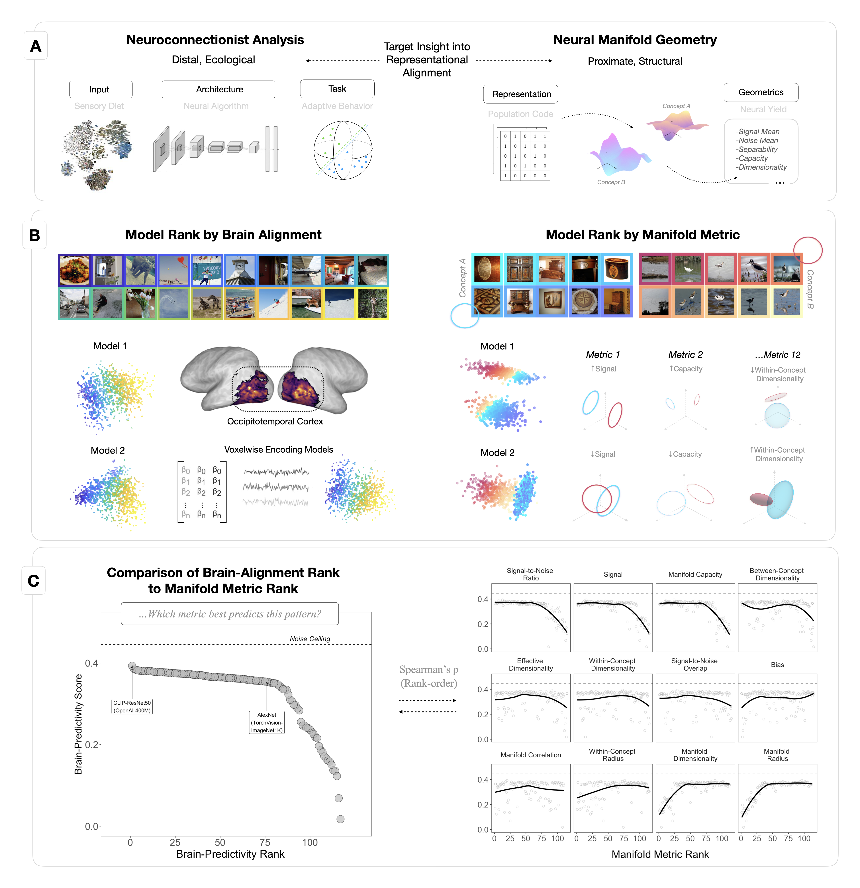

# BMM-Geometrics
Model-based manifold geometry analysis of cortical representation in the human ventral visual stream.



Code and data coming soon...

## Manuscript(s)

> *Model manifold analysis suggests the human visual brain is less like an optimal classifier and more like a feature bank*

[@ NeurIPS 2025 NeurReps Workshop](https://openreview.net/pdf?id=nuZBUyzBs0)

Colin Conwell (MIT CSAIL) and Michael F. Bonner (Johns Hopkins University) 


## BibTex Citation

To cite this work, please use the following BibTeX entry:

```bibtex
@inproceedings{conwell2025model,
  title={Model manifold analysis suggests the human visual brain is less like an optimal classifier and more like a feature bank},
  author={Conwell, Colin and Bonner, Michael},
  booktitle={NeurIPS 2025 Workshop on Symmetry and Geometry in Neural Representations},
  year={2025} 
}
```
